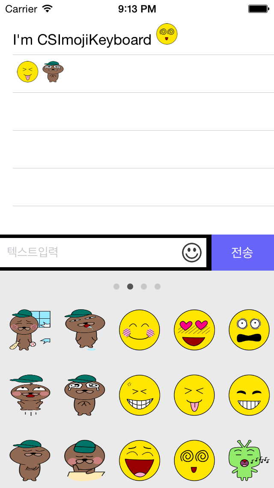

# CSImojiKeyboard
iOS custom emoticon keyboard

#Requirements
	iOS 8.0+

#Usage

	You can figure out how to use from example. Check out Demo.
	To use CSImojiKeyboard in your project, just drag the CSImojiKeyboard group folder and drop to your project. 

#License
	The content of this project itself is licensed under the GPL v2, but sample emoticon images are not allowed to use public. It's owned by Korea Internet Center inc. 
